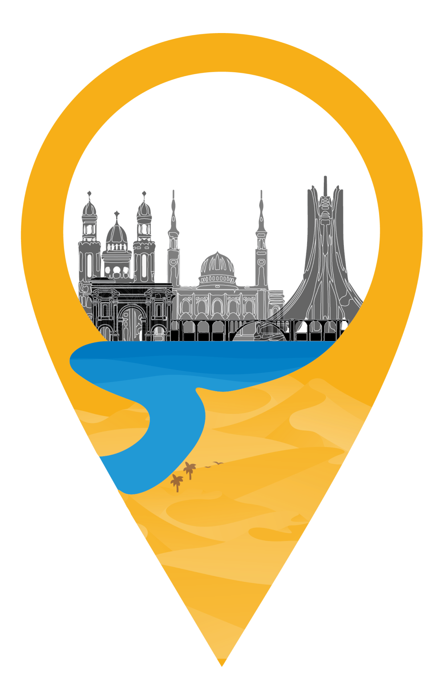

# Win Nrou7ou - Algerian eTourisme Web Application

## Table of Contents

1. [Overview](#overview)
2. [Features](#features)
    - [Multi-language Support](#1-multi-language-support)
    - [Touristic Places](#2-touristic-places)
    - [360 View](#3-360-view)
    - [Events in Algeria](#4-events-in-algeria)
    - [Interactive Chatbot](#5-interactive-chatbot)
    - [Admin Dashboard](#6-admin-dashboard)
3. [Demo Videos](#demo-videos)
4. [Tech Stack](#tech-stack)
5. [Development](#development)

## Overview

Welcome to Win Nrou7ou, an innovative eTourisme web application focused on showcasing the beauty and richness of tourism in Algeria. This application was developed during the 3rd year at ESI Algiers using Next.js for the frontend and MySQL as the relational database.

## Features

### 1. Multi-language Support

-   Explore Win Nrou7ou in your preferred language for a personalized experience.

### 2. Touristic Places

-   Discover over 300 iconic Algerian tourist sites with detailed information.
-   Each location includes images, reviews, historical descriptions, location coordinates, and other essential data.
-   Utilize an interactive map with clustering for a better visualization of tourist hotspots.
-   Benefit from search and filter options to find specific places of interest.
-   Receive custom suggestions based on your preferences.

### 3. 360 View

-   Immerse yourself in high-quality 360 views of more than 80 breathtaking locations.

### 4. Events in Algeria

-   Stay informed about upcoming events across Algeria with specific details.

### 5. Interactive Chatbot

-   Engage with an interactive chatbot tailored to provide information and assistance related to tourism in Algeria.

### 6. Admin Dashboard

-   Manage and update the content of the website seamlessly through the admin dashboard.

## Demo Videos

-   [Demo of Win Nrou7ou Web Application](https://youtu.be/b_-SNg4mGWg)
-   [Brief Explanation of the solution Solution](https://youtu.be/vPuQy5XQS6E)

## Tech Stack

-   **Frontend/Backend :** Next.js deployed in vercel
-   **Database:** MySQL deployed in railway

## Development

This web application was crafted during the 3rd year at ESI Algiers, reflecting a commitment to delivering a user-friendly and visually engaging platform for exploring Algerian tourism.

Feel free to explore, enjoy, and let Win Nrou7ou guide you through the wonders of Algeria!
